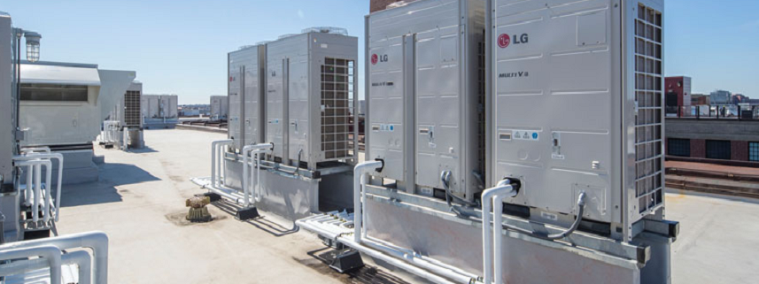
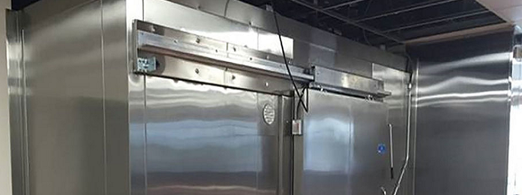
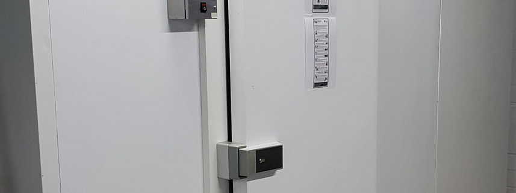
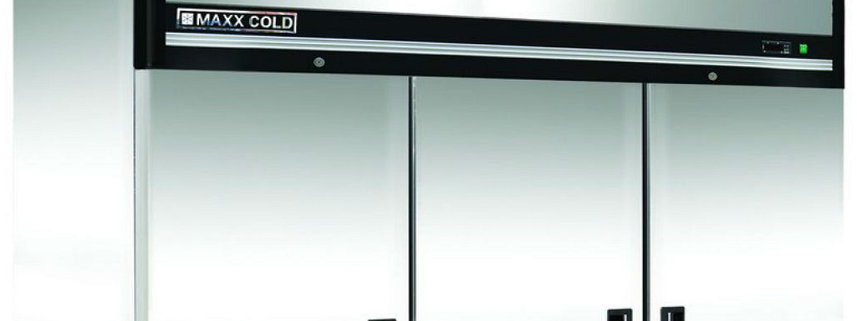
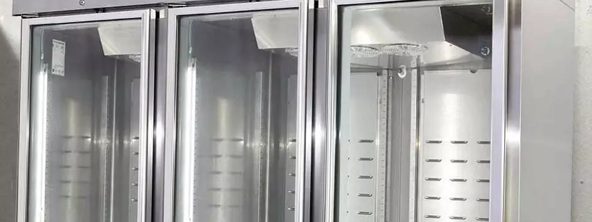

# SmartKitchenOPCUA2IoTCentral
Demonstrates the use of OPC-UA to Monitor the Equipment in a Smart Commercial Kitchen with Telemetry and Integration to Azure IoT Central via a Transparent Gateway with Protocol Translation.

## Overview
This demonstration is a reference implementation of the following...

* <b>OPC-UA Server</b> - Based on the popular FreeOPcUa project for Python.
* <b>Powerful Emulation</b> - Dynamic Configuration of OPC-UA Server, Nodes and Variables allow you to emulate topologies. In this project it is an instance of a Smart Commercial Kitchen.
* <b>Azure IoT Central SaaS Integration</b> - Azure IoT Central is a rich Software as a Service (SaaS) application that provides Telemetry, Device Management and Data Visualizations. That is just a small part of what it can do. We want to provide you with a way to understand and leverage these features with little coding and tons of power!

## Smart Kitchen Appliances
The core of this demo application for Azure IoT Central is the emulation of commercial kitchen. We have included the following standard appliance models...

* Ambient Environment
* Kitchen HVAC System
* Walk In Freezer
* Walk In Refrigerator
* Standing Freezer
* Standing Refrigerator
* Fryer
* Cold Table
* Dishwasher

Let's go through the telemetry for each model...

## Kitchen HVAC System

 

    Measurements
    ---------------------------------
    * Airflow Temperature
    * Main Motor RPM
    * CFM

    Baselines and Trends
    ---------------------------------
    * Ideal Temperature = 68 F
    * Main Motor RPM > Trend
    * CFM > Trend

## Walk In Freezer
 

    Measurements
    ---------------------------------
    Temperature
    Humidity
    Door Open Count
    Door Ajar
    Compressor Health

    Baselines and Trends
    ---------------------------------
    Ideal Temperature = 0 F
    Ideal Humidity = 100 RH
    Door Open Count is a Trend
    Door Ajar is a Trend
    Compressor Health > 98

## Walk In Refrigerator
 

    Measurements
    ---------------------------------
    Temperature
    Humidity
    Door Open Count
    Door Ajar
    Compressor Health

    Baselines and Trends
    ---------------------------------
    Ideal Temperature = 39 F
    Ideal Humidity = 65 RH
    Door Open Count is a Trend
    Door Ajar is a Trend
    Compressor Health > 98

## Standing Freezer

    Measurements
    ---------------------------------
    Temperature
    Humidity
    Door Open Count
    Door Ajar
    Compressor Health

    Baselines and Trends
    ---------------------------------
    Ideal Temperature = 0 F
    Ideal Humidity = 100 RH
    Door Open Count is a Trend
    Door Ajar is a Trend
    Compressor Health > 98

## Standing Refrigerator

    Measurements
    ---------------------------------
    Temperature
    Humidity
    Door Open Count
    Door Ajar
    Compressor Health

    Baselines and Trends
    ---------------------------------
    Ideal Temperature = 39 F
    Ideal Humidity = 65 RH
    Door Open Count is a Trend
    Door Ajar is a Trend
    Compressor Health > 98
