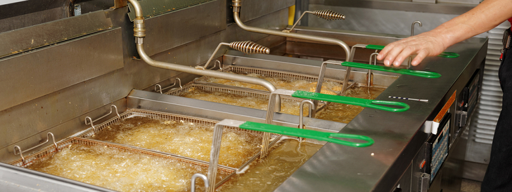
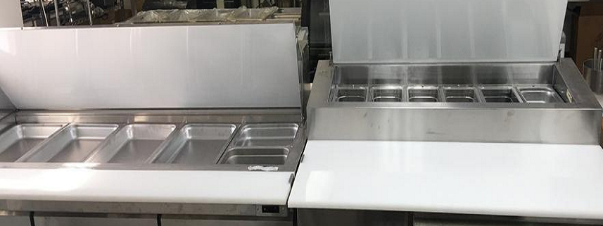
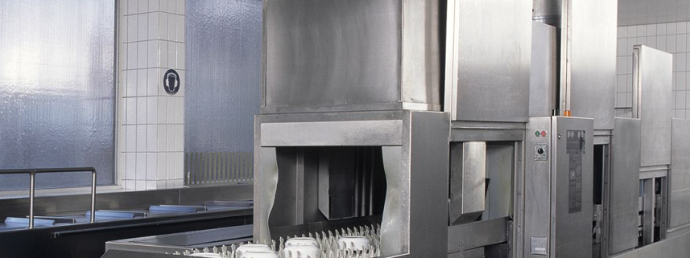

# Smart Kitchen OPC-UA Integration with IoTCentral
Demonstrates the use of OPC-UA to Monitor the Equipment in a Smart Commercial Kitchen with Telemetry and Integration to Azure IoT Central via a Transparent Gateway with Protocol Translation.

## Overview
This demonstration is a reference implementation of the following...

* <b>OPC-UA Server</b> - Based on the popular FreeOPcUa project for Python.
* <b>Powerful Emulation</b> - Dynamic Configuration of OPC-UA Server, Nodes and Variables allow you to emulate topologies. In this project it is an instance of a Smart Commercial Kitchen.
* <b>Azure IoT Central SaaS Integration</b> - Azure IoT Central is a rich Software as a Service (SaaS) application that provides Telemetry, Device Management and Data Visualizations. That is just a small part of what it can do. We want to provide you with a way to understand and leverage these features with little coding and tons of power!

## Smart Kitchen Appliances
The core of this demo application for Azure IoT Central is the emulation of commercial kitchen. We have included the following emulated appliance models that you would find in a commercial kitchen...

* Ambient Environment
* Kitchen HVAC System [LINK: Detailed Overview for the Kitchen HVAC System](./KitchenHVACSystemOverview.md)
* Walk In Freezer [LINK: Detailed Overview for the Walk In Freezer](./WalkInFreezerOverview.md)
* Walk In Refrigerator [LINK: Detailed Overview for the Walk In Refrigerator](./WalkInRefrigeratorOverview.md)
* Standing Freezer [LINK: Detailed Overview for the Standing Freezer](./StandingFreezerOverview.md)
* Standing Refrigerator [LINK: Detailed Overview for the Fryer](./StandingRefrigeratorOverview.md)
* Fryer [LINK: Detailed Overview for the Fryer](./FryerOverview.md)
* Cold Table [LINK: Detailed Overview for the Cold Table](./ColdTableOverview.md)
* Dishwasher [LINK: Detailed Overview for the Dishwasher](./DishwasherOverview.md)

Let's go through the telemetry for each model...

## Kitchen HVAC System
 

[LINK: Detailed Overview for the Kitchen HVAC System](./KitchenHVACSystemOverview.md)

    Measurements
    ---------------------------------
    * Airflow Temperature
    * Main Motor RPM
    * CFM

    Baselines and Trends
    ---------------------------------
    * Ideal Temperature = 68 F
    * Main Motor RPM > Trend
    * CFM > Trend

## Walk In Freezer
 

[LINK: Detailed Overview for the Walk In Freezer](./WalkInFreezerOverview.md)

    Measurements
    ---------------------------------
    Temperature
    Humidity
    Door Open Count
    Door Ajar
    Compressor Health

    Baselines and Trends
    ---------------------------------
    Ideal Temperature = 0 F
    Ideal Humidity = 100 RH
    Door Open Count is a Trend
    Door Ajar is a Trend
    Compressor Health > 98

## Walk In Refrigerator
 

[LINK: Detailed Overview for the Walk In Refrigerator](./WalkInRefrigeratorOverview.md)

    Measurements
    ---------------------------------
    Temperature
    Humidity
    Door Open Count
    Door Ajar
    Compressor Health

    Baselines and Trends
    ---------------------------------
    Ideal Temperature = 39 F
    Ideal Humidity = 65 RH
    Door Open Count is a Trend
    Door Ajar is a Trend
    Compressor Health > 98

## Standing Freezer

[LINK: Detailed Overview for the Standing Freezer](./StandingFreezerOverview.md)

    Measurements
    ---------------------------------
    Temperature
    Humidity
    Door Open Count
    Door Ajar
    Compressor Health

    Baselines and Trends
    ---------------------------------
    Ideal Temperature = 0 F
    Ideal Humidity = 100 RH
    Door Open Count is a Trend
    Door Ajar is a Trend
    Compressor Health > 98

## Standing Refrigerator

[LINK: Detailed Overview for the Standing Refrigerator](./StandingRefrigeratorOverview.md)

    Measurements
    ---------------------------------
    Temperature
    Humidity
    Door Open Count
    Door Ajar
    Compressor Health

    Baselines and Trends
    ---------------------------------
    Ideal Temperature = 39 F
    Ideal Humidity = 65 RH
    Door Open Count is a Trend
    Door Ajar is a Trend
    Compressor Health > 98

## Fryer

[LINK: Detailed Overview for the Fryer](./FryerOverview.md)

    Measurements
    ---------------------------------
      Temperature
      Oil Quality
      Fryer Heater Health

    Baselines and Trends
    ---------------------------------
      Ideal Temperature = 350-360 F
      Oil Quality > 75
      Fryer Heater Health > 98

## Cold Table

[LINK: Detailed Overview for the Cold Table](./FryerOverview.md)

    Measurements
    ---------------------------------
      Temperature
      Compressor Health

    Baselines and Trends
    ---------------------------------
      Ideal Temperature = 39 F
      Compressor Health > 98

## Dishwasher

[LINK: Detailed Overview for the Dishwasher](./DishwasherOverview.md)

    Measurements
    ---------------------------------
      Heating Element Health
      Motor Health
      Wash Cycles
      Temperature

    Baselines and Trends
    ---------------------------------
      Ideal Temperature = 180-185 F
      Heating Element Health > 98
      Motor Health > 98
      Wash Cycles - Trend Count
